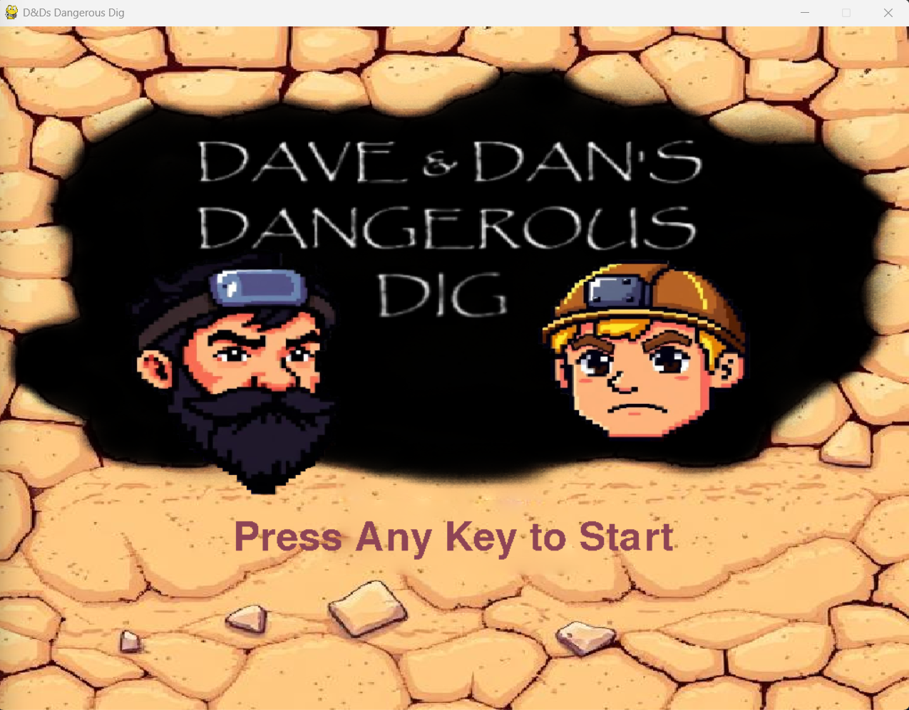
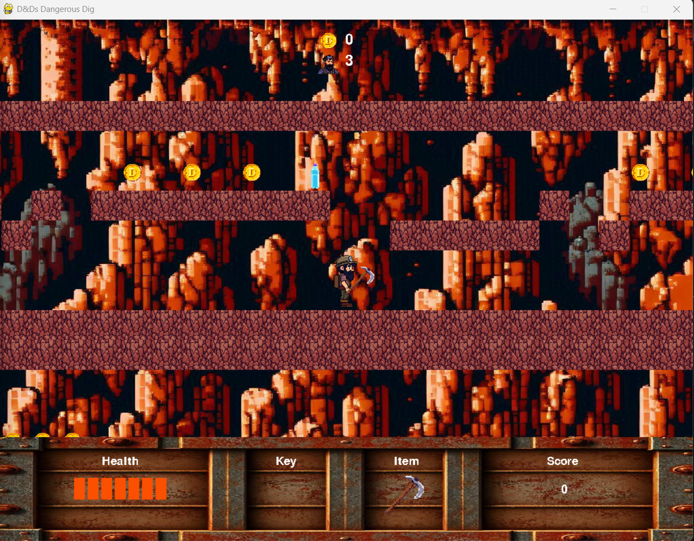
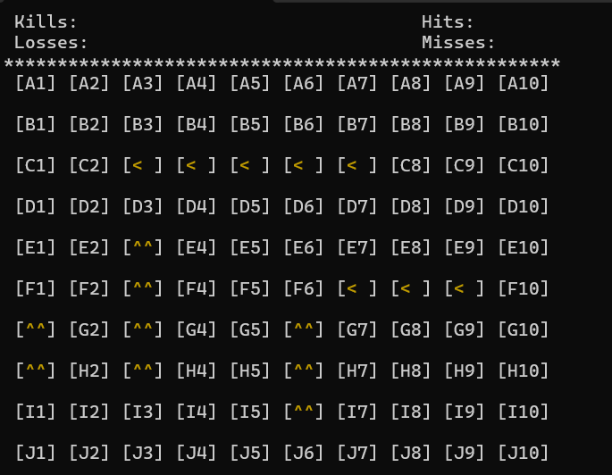
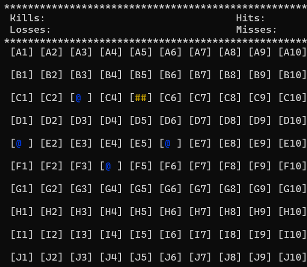
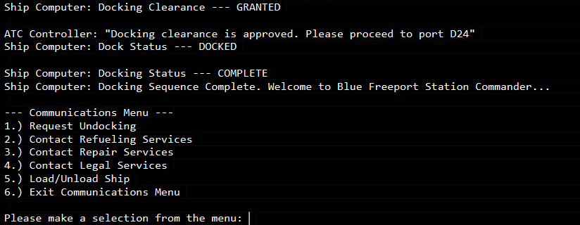
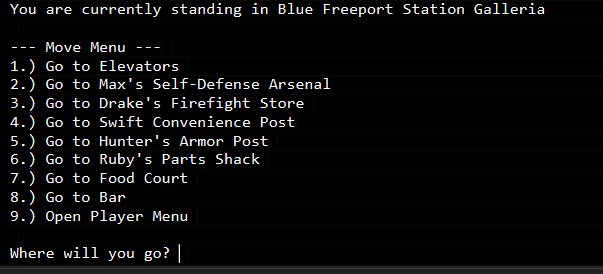
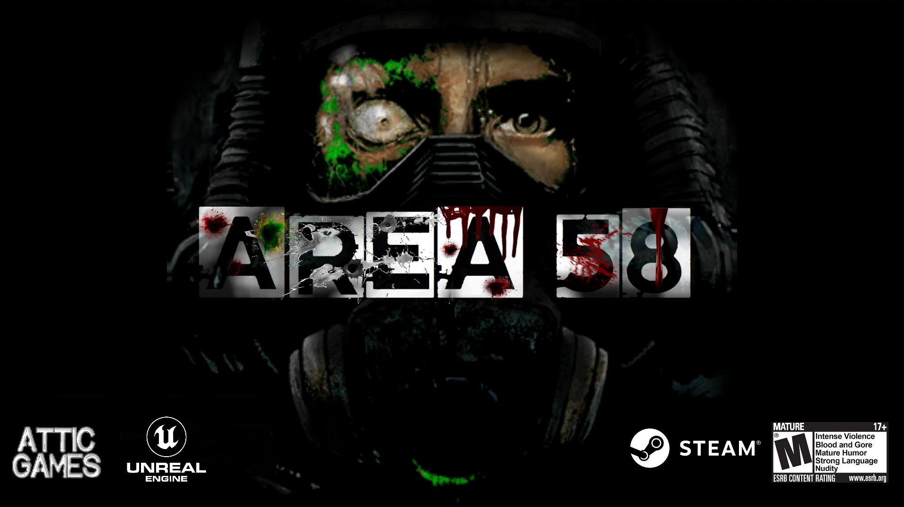
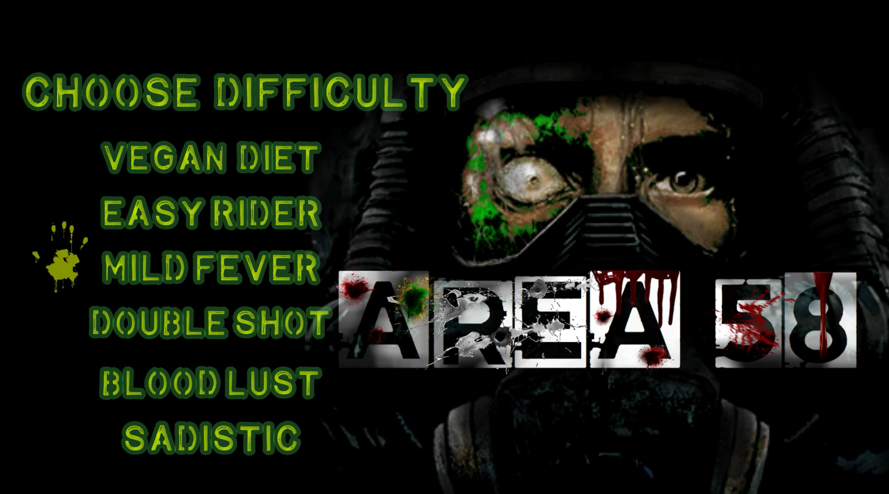
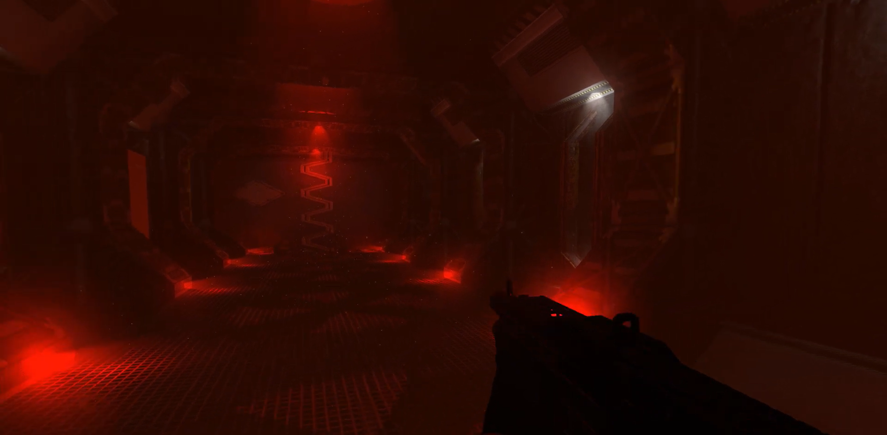
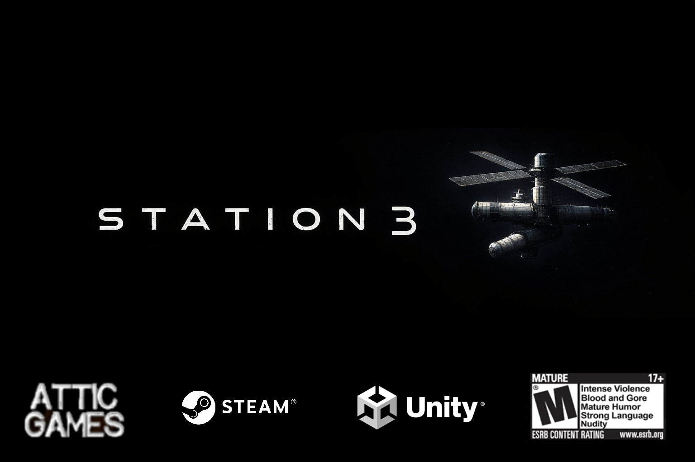

# ---------------------------------------------------------------------------

# Well, Hello There! I'm Danny
# "Journeyman" Programmer | Founder of 'Attic Games'| Student of Machine Learning

# ---------------------------------------------------------------------------

### Languages Known

# C# | C++ | OpenGL | Windows API | Linux (Debian) 
# Python | SQL | Apache Server Language | VSCode

### IDEs Used

# Wing | Visual Studio | CodeBlocks | Codespaces | Jupyter Notebook 

### Projects I've Worked On
#
#       Academia
# -------------------------
# - "Worst Restaurant Finder": Co-Developed with Augusto Menegasse (2022)
# - "LMS: Library Management System (Terminal Based)": 1-Week Project for Software Deployment Course (2025)
# - Work Integrated Project with Go Auto in Machine Learning (2025)
# - Constructed an End-to-End Pipline for Machine Learning Model Deployment (2025)
#
# -------------------------
#       Contractor
# -------------------------
# - Creating a File-System for a Private-Business' Network (2023)
# - Co-Developed Pathing System for NPCs in an Indie Game (Never Released - Canceled) (2020)
# - Contributed to "Ghost Code" for Resolving Aggressive NPC-Behavior in FPS Title "Ready or Not" (Alpha Version - 2022)
# - Created a "Pseudo-LAN" Script Allowing Machines to "Chat" with Each Other on the same Network (2022)
# - Built Web-Scrapers (Weather, Locations) for Individuals within Scientific Professions for their Research (2021)
#
# -------------------------
#      Personal/Self
# -------------------------
# - Helped Develop a Game-Mod titled "Dystopia" Made from the Half-Life 2 Source Engine (Level Designer - 2004 | Won Mod of the Year)
# - Contributed to Open Source Version of FPS Arena Shooter titled "Unreal Tournament" (Level Designer - 2015:2016)
# - Contributed to Open Source Project "NASSP Apollo Project" for Orbiter 2016 Originally Developed by MIT (Fuel Cell System Purge Logic - 2021)
# - Created a Terminal-Based Version of "Battleship" in C++ (2024)
# - Created a Side-Scroller Adventure Game (Python) titled "Dave & Dan's Dangerous Dig" (Lead Programmer - 2024)

# -----------------------------------------------
## Here are some glimpses of that work!
# ------------------------------------------------

**Dave & Dan's Dangerous Dig**

  
  

**C++ Battleship (Terminal)**

  
  

**Space RPG Terminal Game (Python)**

  
  

# ---------------------------------------------------------
## So, What's Cookin' Next???
# --------------------------------------------------------

### Area-58 
**Science-Fiction Action | First Person Shooter | Unreal Engine 4**

**Synopsis:**
*Set in 1996, deep within the Nevada desert, hides a top-secret government facility. Area 58, a sister-site to the infamous Area-51, sends a recovery team nearby to investigate a meteorite impact. When a sample is returned and investigated, the base quickly discover that the collected specimen is holding something darker than just clues to our universe...*

*Run, Think, Shoot, Survive through 3 episodes of knuckle-biting, hair-raising action sprawling over 30 levels. Battle with ever-evolving enemies using an arsenal of weaponry. Get immersed in unique sound design and original music while uncovering the secrets of Area-58. Shoot first, think later, and maybe you'll survive...*

**Preview Images:**

  
  

**Dev Roles:**
- Lead Programmer
- Asset Modeler
- Level Design
- Sound Design
- Music Arrangement & Mixing
- Writer

### Station 3 (Recently Announced)
**Psychological Suspense Space-Sim | First Person Survival | Unity Engine 6**

**Synopsis:**
*5 Days. You only have to wait 5 days for the relief crew. The Nation is very proud of you. Everyone at home is celebrating what you have done, what you have made possible, and everyone is praying for your safe return to Earth. You will receive the highest commendation that The Nation can offer and a hero's welcome. Your mission has not only solified your place within The Nation's history books but also has proven the strength and ingenuity of The Nation's brightest engineers. You have gone beyond the capability and the limits of what was possible for our home in orbit. We all know in our hearts that you will survive...*

*Experience high-tension and suspense as you are the caretaker for a space station in orbit. Manage realistic systems, avert catastrophes, maintain habitability in an environment wanting to kill you. Fires, Floods, Rapid Decompressions, Power Loss, Freezing, and MANY other life-threatening emergencies await you after one wrong step or complacency. Relay clicks, airlock clacks, and everything else that will go bump in the night will keep you on your toes as the station wears down. Make it until the crew transfer and you're going home...*

**There are no Development Images at this Time...**

**Dev Roles**
- Lead Programmer
- Asset Modeler
- Sound Design
- Music Artist
- Writer

# -------------------------------------------------------------
# My Origin Story (About Me)
# -------------------------------------------------------------

#My journey into becoming a developer started in 2018 when I had realized that upon flunking calculus-based physics, the venture into becoming an Astrophysicist like Carl Sagan or an Astronaut like Charlie Duke would remain exactly where it started as... A Dream. With a heavy heart and without any direction, the rest of the semesters proceeded in much the same way. That is, until I found the introduction course to programming. Intimidated at first, I quickly realized... Hey!, I can do something! And I can do it pretty alright!. Comp-Sci course after Comp-Sci course, ingratiating myself in the works of Information & Cyber Security, Operating Systems, and Game Engines throughout history, a natural fit was quickly established. Not only did I find a new love but also a new home. 

 Beginning with Python, gravitating to C++ alongside C#, and eventually picking up some other goodies along the way with SQL, Open GL, Some Linux, Some Windows Language, and Apache Server Language. The skills felt like they were growing parallel with the curiousity to push things farther. First, it was all about the terminal. LOVE the terminal. We're going old school! No rendering, no visuals, nothing but only text, baby. The first item was to recreate Wheel of Fortune in Python, it worked pretty good! but I never implemented that dang "Bonus Round" yet... No worries because the next thing was recreating casino games like slots or blackjack, which worked good too! I even put in a tiny-little logic loop for the blackjack dealer's actions as to when they'd take a card or stay with what they have. These little things accomplished as a sequence over time delivered enough confidence to start becoming ambitious and comfortable. 

Before leaving that University, I had begun work on an open-world space RPG game (terminal based, of course) replicating the likes of Elite Dangerous, Star Citizen, name-your-favorite-. First, keeping it simple like working out how the player data is kept and interacted with the world and the associated states/flags for their interactions. After a while, I needed an actual "game space" to test this thing with so I immediately began work on a generation system that can make a space of stars. Essentially the "galaxy" that the player would be zooming around in. The end result was a single-run script file containing a bunch of from-scratch made processes that would first randomly generate a number, use that number as the star count for the galaxy and then I had made a random name generator for every star. The random name generator was made using a list of the entire alphabet, a list of consanants, a list of vowels. 3 Random numbers are generated in respect to the 3 lists and are used as indices to grab their letters. Those letters are then concatinated together to form those random works like "Toake" or "Exo". It was a pretty neat way to have Sci-Fi sounding star and planet names with the option to regulate the size of the name at your desire. From there station systems were made like refueling, repairing, boarding/deboarding passengers or even transferring resources from a station to another. A movement system was eventually made as well using dictionaries as the foundation or "layout" of the map or level the player is currently on. Oh my goodnes, there was a lot to it. To cut a long story short, I eventually made a "playable tech demo" of the game and passed it around to friends and fellow peers in my computer-science courses and it seemed that everyone loved it.

Upon making other little fun things with code and having people play it, I quickly became comfortable with the prospect of turning this hobby into something that can earn some money. I began learning C++, learning the Unity Engine which lead to learning C# too, Unreal Engine, and even the Source Engine as outdated as it already was at that time. Once I was getting tired of hunting through contractual side-gigs I got together with a very close buddy and we began making stuff. Despite everything being on a low scale, low risk, I felt that the time had come to finally put aside "tinkering about" and "playing around" for taking the first step into something bigger and something more real. From that moment was the genesis of creating 'Attic Games' and releasing the ideas that have plagued me for a long while up to that point. Currently in development, is what we aim to be our first leaps into the PC Game Market sphere... Station 3 and Area 58. There is preliminary dev-work being done into bringing the terminal based space game over into a 3D format on Unity or Unreal but it is not at all yet near an announceable state.

Well geez, that was a long one... Thanks for hanging around this long and hopefully that was slightly interesting or at least mildly amusing... If it was neither of those things then I suppose I deserve a trojan for that...Sorry!